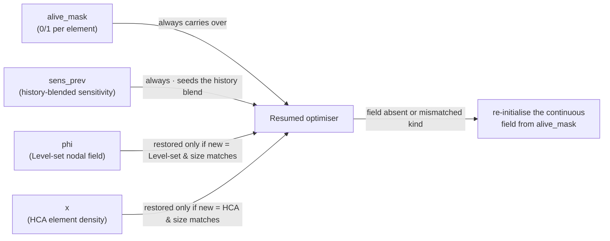

# Switching optimisers mid-run (e.g. BESO → Level-set)

Since the GUI can **continue a stopped run with a different optimiser** (the ↻ Resume
"continue" flow), you can run a topology optimisation in stages — for example a few
iterations of BESO to find the load-path topology fast, then a few of Level-set to
fair out the boundary. This note explains what actually happens at the seam, when it
helps, when it hurts, and how to do it well.

## TL;DR

Mechanically safe and occasionally very useful. The classic win is **"aggressive
discrete method to find the topology fast, then Level-set to clean the boundary."**
But in oropt the **only state that survives a switch is the binary alive mask** (plus
the history-blended `sens_prev`); every optimiser's *continuous* field is re-built from
that mask, and — the biggest footgun — **switching the optimiser swaps its entire config
block at once** (`target_volume_fraction`, `filter_radius`, `protect_layers`,
`evolution_rate`, `convergence_*`, `max_iter`), not just the update rule.

## How a switch works in oropt (the state hand-off)

A "switch" is just a `--resume` where you changed `cfg.optimizer`. The loop rebuilds
everything from the newly-selected block and reloads `checkpoint.npz`, which holds
`iteration`, `alive_mask`, `sens_prev`, and each field-carrying optimiser's own field
(`phi` for Level-set, `x` for HCA). A field is restored **only into an optimiser of the
matching kind and matching size** — a nodal `phi` never lands in HCA's per-element `x`,
so a cross-kind switch correctly falls through to a re-initialisation from the mask.

| Optimiser | Continuous state | Checkpointed? | On a switch it… |
|---|---|---|---|
| **BESO** (`beso.py`) | none (rank/threshold on the mask) | n/a | needs only the mask → **lossless in/out** |
| **TOBS** (`tobs.py`) | none (per-iter ILP on the mask) | n/a | needs only the mask → **lossless in/out** |
| **Level-set** (`levelset.py`) | `phi` (nodal field) | yes | switching *in from* a non-Level-set stage re-inits `phi` from the mask via energy-rank spread (`_init_phi`) |
| **HCA** (`hca.py`) | `x` (element density) + `_field_prev` | `x` yes (`_field_prev` no) | switching *in from* a non-HCA stage re-inits `x` to binary from the mask |

Two consequences:

- **The binary mask is the only lingua franca.** BESO and TOBS are stateless, so
  switching *between the discrete methods* and *out of* Level-set/HCA is essentially
  free — you lose nothing they weren't already storing.
- **Switching *into* a continuous-field method is lossy.** Level-set reconstructs its
  smooth `phi` from whatever (possibly ragged) mask the discrete method left; HCA
  rebuilds densities as hard 0/1. Their sub-element boundary information is regenerated
  from scratch, which costs a short transient of (expensive) solves.

## Advantages

- **Coarse-to-fine / explore-then-refine (the strongest case).** BESO and TOBS are
  aggressive discrete *carvers* — good at rapidly discovering *which members exist*
  (they rank the whole part and can nucleate/delete anywhere). Level-set is good at
  *where the boundary sits* — smooth, low-stress-concentration, manufacturable
  interfaces — but evolves slowly. Running BESO first to settle the topology, then
  Level-set to regularise the boundary, plays each to its strength. This is the discrete
  analogue of *continuation* in gradient TO (SIMP penalisation ramping).
- **Escaping a method-specific stall.** Each method has failure modes (Level-set
  no-nucleation / prune-leak / velocity-squash history; BESO plateau collapse; TOBS ILP
  infeasibility; HCA slow decay). A few iterations of a *different* method can kick a run
  out of a stall its current method cannot escape, then hand back a cleaner mask.
- **Nucleation vs. smoothing division of labour.** BESO/TOBS create holes by ranking
  (anywhere, immediately); Level-set's hole creation is a bolted-on reaction term. Let
  the discrete method punch the hole pattern and the Level-set method fair it out.
- **Compute budget.** Every iteration is an expensive nonlinear OpenRadioss solve
  (~1 hr/iter on the reference model). BESO with a healthy `evolution_rate` reaches
  target volume in far fewer iterations than Level-set with a small `dt`. Front-load the
  volume reduction with a discrete method and spend only a few Level-set iterations at
  the end.
- **Robustness staging for nonlinear/contact.** HCA is the LS-TaSC method built for
  nonlinear/contact with no gradients; Level-set's boundary evolution is smoother near
  constraints. If BESO oscillates against a stress limit, finishing under HCA/Level-set
  can settle it.

## Disadvantages / risks

- **Re-init transient — you pay solves to rebuild what you discarded.** The first 1–3
  iterations after switching into Level-set spend their velocity budget regularising the
  jagged boundary the discrete stage left, not improving the structure. HCA discards its
  controller memory.
- **The whole config block swaps (the real footgun).** Because the loop reads all
  run-level knobs from `cfg.active_opts()`, switching optimiser changes *all of them*. In
  the reference config, `beso.target_volume_fraction = 0.7` but
  `levelset.target_volume_fraction = 0.4`: a BESO→Level-set switch there inherits BESO's
  ~0.7-volume mask and immediately drives toward 0.4. Same trap for `filter_radius`,
  `protect_layers`, `evolution_rate`, `convergence_*`. **Align these across blocks or the
  switch itself injects a step change.**
- **`sens_prev` / filter continuity.** The history blend
  `history_weight·(W@raw) + (1-history_weight)·sens_prev` is meaningful across a switch
  only if `filter_radius` and `sensitivity` are unchanged (each block has its own filter
  matrix `W`). Changing `energy`→`vonmises` or the radius at the same time mixes two
  inconsistent fields.
- **No convergence guarantee across the seam.** Each method's monotonicity/convergence
  argument assumes it drives the whole run (TOBS's successive linearisation, Level-set's
  monotone τ-bisection, HCA's controller stability). Stitching stages together is
  heuristic; expect a possibly non-monotone objective or a transient feasibility loss at
  the switch.
- **Frequent switching wastes solves.** Switching every few iterations lets the re-init
  transients dominate; you re-pay the field reconstruction each time.

## Recommended pattern

1. **Stage 1 — BESO (or TOBS):** the bulk of the volume reduction; finds the topology fast.
2. **Stage 2 — Level-set:** a *short* finishing pass (a handful of iterations) to smooth
   the boundary for manufacturability / stress.

Before switching, **align the destination block** (`target_volume_fraction`,
`filter_radius`, `protect_layers`, `sensitivity`) to where the source stage left off, and
use the GUI's **"↻ + more iterations"** to extend past `max_iter`. Avoid switching *into*
HCA expecting continuity of anything but the mask, and don't change `sensitivity` /
`filter_radius` at the same time as the optimiser unless deliberate.

## Provenance & guard rails (what makes this first-class)

Because a switched run is easy to misread, oropt records and flags the switch:

- **`run.log`** appends on `--resume` (never truncates), so it is the full multi-stage
  audit trail; it prints `resumed at iteration N`, the active optimiser, and the guards
  below. The Monitor tab's "Run log (tail)" panel surfaces it in the browser.
- **`history.csv` has an `optimizer` column**, so every iteration records which method
  produced it (older CSVs keep their header; the column is simply absent for pre-upgrade
  rows).
- **Per-stage config snapshots.** A resume preserves the prior stage's `config_used.yaml`
  as `config_used.<timestamp>.yaml` before overwriting, so a multi-stage run keeps every
  stage's exact config instead of only the last.
- **Resume guards** (`loop.resume_warnings`, logged to `run.log`): an
  `OPTIMISER SWITCHED a -> b` line spelling out that the field re-inits and all knobs now
  come from the new block (with its `target_vf` / `filter_radius` / `protect_layers`), and
  a warning when the resumed volume fraction is well above the new stage's target (a large
  removal is coming).
- **HCA's density field `x` is checkpointed**, so an HCA stage (or an HCA→HCA resume)
  keeps its controller memory instead of cold-starting from a binary mask.

## Theory note

This is a *continuation / homotopy* strategy without continuation's usual backing. In
gradient SIMP, `p`-continuation is principled because it is the *same* optimiser on a
smoothly deformed problem. Switching *optimisers* deforms the *update operator*, not the
problem, so there is no descent/continuity guarantee across the seam — it is a greedy
"explore with a coarse operator, refine with a fine one" heuristic. It helps when the
operators have complementary biases (discrete nucleation vs. smooth boundary evolution)
and hurts when they don't (you just eat re-init transients).

See also: `docs/levelset_stuck_analysis.md` (Level-set failure modes) and
`docs/add_material_boxes.md`.
